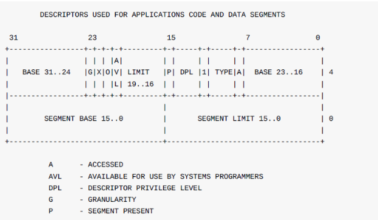
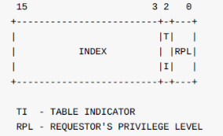
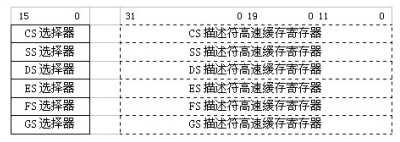

# NEMU2020 Programming Assignment

This project is the programming assignment of the class ICS(Introduction to Computer System) in College of Intelligence and Computing, Tianjin Univerisity.

This project is introduced from Nanjin University in 2016. Thank you for  Prof. Chunfeng Yuan of NJU and Dr. Zihao Yu of ICT.

The following subprojects/components are included. Some of them are not fully implemented.
* NEMU
* testcase
* uClibc
* kernel
* typing game
* NEMU-PAL

## NEMU

NEMU(NJU Emulator) is a simple but complete full-system x86 emulator designed for teaching. It is the main part of this programming assignment. Small x86 programs can run under NEMU. The main features of NEMU include
* a small monitor with a simple debugger
 * single step
 * register/memory examination
 * expression evaluation with the support of symbols
 * watch point
 * backtrace
* CPU core with support of most common used x86 instructions in protected mode
 * real mode is not supported
 * x87 floating point instructions are not supported
* DRAM with row buffer and burst
* two-level unified cache
* IA-32 segmentation and paging with TLB
 * protection is not supported
* IA-32 interrupt and exception
 * protection is not supported
* 6 devices
 * timer, keyboard, VGA, serial, IDE, i8259 PIC
 * most of them are simplified and unprogrammable
* 2 types of I/O
 * port-mapped I/O and memory-mapped I/O

## testcase

Some small C programs to test the implementation of NEMU.

## uClibc

uClibc(https://www.uclibc.org/) is a C library for embedding systems. It requires much fewer run-time support than glibc and is very friendly to NEMU.

## kernel

This is the simplified version of Nanos(http://cslab.nju.edu.cn/opsystem). It is a uni-tasking kernel with the following features.
* 2 device drivers
 * Ramdisk
 * IDE
* ELF32 loader
* memory management with paging
* a simple file system
 * with fix number and size of files
 * without directory
* 6 system calls
 * open, read, write, lseek, close, brk

## typing game

This is a fork of the demo of NJU 2013 oslab0(the origin repository has been deleted, but we have a fork of it -- https://github.com/nju-ics/os-lab0). It is ported to NEMU.

## NEMU-PAL

This is a fork of Wei Mingzhi's SDLPAL(https://github.com/CecilHarvey/sdlpal). It is obtained by refactoring the original SDLPAL, as well as porting to NEMU.

# PA3

## 分段

### 16位的8086

$$
physical\_address = (seg\_reg<<4) + offset
$$

- seg_reg： 段寄存器的值

- offset：偏移量

- seg_reg和offset的搭配：

	|              |                     seg_reg寄存器 16位                     | offset寄存器 |                             说明                             |
	| :----------: | :--------------------------------------------------------: | :----------: | :----------------------------------------------------------: |
	|    取指令    |                             CS                             |   IP(eip)    |                                                              |
	| 内存数据访问 |  DS(Data Segment)，也可以显式使用ES(Extra Segment)    |              | $$mov\quad\%ax,(\%bx)$$ 用寄存器传输语言（RTL）描述就是：$$M[DS:BX]<-R[AX]$$ |
	|     堆栈     | SS(stack segment) 或 SP(stack pointer) 和 BP(base pointer) |              |                                                              |
	|    字符串    |                             ES                             |              |                                                              |

问题：

1. 1MB内存容量的瓶颈
2. 恶意程序(段寄存器随便改)

### 32位80386

- CR0 寄存器：

	32位4GB足够了，理论上可以去掉段寄存器，但为了兼容，设置了CR0寄存器的PE位作为开关，为1时进入保护模式

- GDT **全局**描述符表：

  

- GDTR

- LDT

- LDTR

- 段寄存器：

	- 16位段选择符

		index：段描述符的索引

		

	- 隐藏描述：

		从描述符表中获取：base addr, limit, type, other information

	- 

分段机制

1. 通过段寄存器的段选择符TI位，决定在哪个表里查找（在LDT还是GDT）
2. 读GDTR或LDTR
3. 读段选择符的index，找到段描述符
4. 在段描述符中读段的基地址，和虚拟地址相加得线性地址

### 80286就有了的进程特权等级

| 进程等级（0最高） |      进程       |
| :---------------: | :-------------: |
|         0         | 内核，GDT，页表 |
|         1         |                 |
|         2         |   一般的程序    |
|         3         |                 |

- DPL域：在段描述符中，描述一个段所在的特权级
- RPL域：段选择符中，描述了请求者所在的特权级
- CPL：指示当前进程的特权级，一般与当前CS寄存器指向的段描述符的DPL相等

$$
数据段切换操作合法\quad iff\quad 请求者和当前进程比目标段权限高
$$

## 分页

### 80386

- 分页模式开关：CR0寄存器的PG位
- 二级页表
	- CR3寄存器：存放页目录基地址
	- present位：是否可用
		- 被交换到磁盘了
		- 未映射的线性地址
	- R/W位：物理页是否可写
	- U/S位：访问物理页需要的权限

### 在`nemu`中

- 添加CR3
- CR0的PG位，初始化时为0
- 修改`lnaddr_read 和 wirte`
- `conmmon.h`
- `kernel/Makefile.part`
- `testcase/Makefile.part`
- `memory.c`
- `tlb指令`顺便写了`cld`

## 总结

CR0寄存器

- PE位（第0位）：1表示启用保护模式；0表示实地址模式
- PG位（第31位）：1表示开启分页（同时需要开启保护模式）；0表示禁止分页
- WP（第16位）：写保护标志。1表示禁止root程序向用户级只读页面执行写；0表示允许

### 逻辑地址->线性地址

- 逻辑地址 = 段选择子selector + 段偏移offset
- 段描述符
- 段描述符表（段描述符的数组）
- 段选择子（段寄存器，存段描述符表的索引）

用selector作为索引，找到对应的段描述符，段描述符中的base + offset 得到线性地址

#### 段描述符

- 段基地址base：线性地址空间中段的起始地址。80386中，32位。
- 段界限：规定段的大小（80386中20位，可以以`B`或`4KB`作为单位）
- 段属性
	- 粒度位（G）：0表示段界限单位是B；1表示4KB
	- 类型（TYPE）：用于区别不同类型的描述符。代码段 or 数据段，可读可写，段的扩展方向等
	- 描述符特权级（DPL）：用来实现保护机制
	- 段存在位：0表示该描述符非法
	- 已访问位：访问该段时自动设置该位，操作系统可以清楚该位

#### 段描述符表

- GDT：全局段描述符表
- GDTR：全局段描述符表的base（线性地址）和长度
- LDT：局部段描述符表
- LDTR：LDT在GDT中的索引

#### 段选择符（原来的段寄存器）

- index：用描述符表的base + index*8 来索引 描述符表
- 表指示位（TI）：0表示访问GDT，1表示访问LDT
- 请求特权级（RPL）：保护机制。只有请求者的RPL > =（数字<=）相应的描述符特权级DPL时，描述符才能被获取

#### 内存分割

8086中有4个16位的段寄存器：CS、DS、SS、ES，分别存放可执行代码的代码段、数据段、堆栈段、其他段的基地址（16位足够了）

80386中有6个16位的段寄存器。但是存放的是段的选择符selector（∵16位放不下地址）。有CS、DS、SS、ES、FS、GS

### 线性地址->物理地址

- i386使用了二级页表

- CR2寄存器：出现异常时

- CR3寄存器（PDBR）：当前进程使用的页目录base（物理地址）

	

	- 高20位：base（页目录页对齐，所以低12位可以存别的）

- 页表项

	

	- P：存在标志。0表示该项无效
	- R/W：读写标志。1表示可读、写、执行，0表示可读、执行（超级用户，即权限为0，1，2时失效）
	- U/S：用户/超级用户标志。1表示all程序可访问；0表示只有超级用户能访问
	- A：已访问标志。
	- D：以修改标志
	- AVL：保留专门给程序用